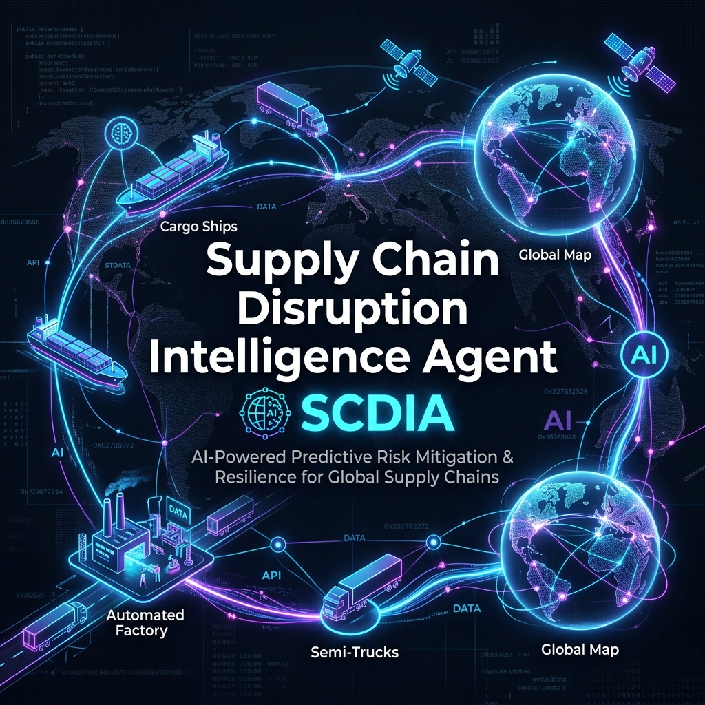
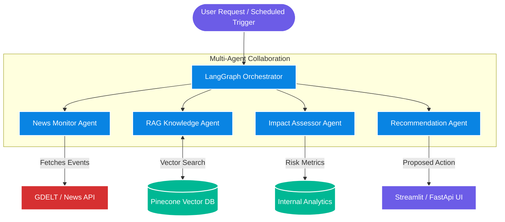

<div align="center">
  

  # Supply Chain Disruption Intelligence Agent
  
  **AI-Powered Monitoring, RAG, and Proactive Mitigation for Global Supply Chains**
  
</div>

## 📌 Project Description

The **Supply Chain Disruption Intelligence Agent** is an advanced AI system designed to proactively monitor global events, assess their impact on supply chains, and recommend actionable mitigation strategies. By combining large language models (LLMs) with real-time news monitoring, vector databases, and multi-agent orchestration, the system provides organizations with unparalleled situational awareness.

Whether it's geopolitical shifts, natural disasters, or logistical bottlenecks, the agent aggregates relevant data, queries historical knowledge bases (RAG), and orchestrates specialized agents to evaluate the exact impact on your supply chain. 

---

## 🏗️ System Architecture

The core orchestration is managed via **LangGraph**, utilizing a multi-agent framework where specialized AI agents collaborate to process data, assess risks, and formulate strategies.



### Key Components

1. **News Monitor Agent:** Continuously tracks global data feeds (GDELT, Kaggle datasets) and news APIs for disruptive events.
2. **RAG Knowledge Agent:** Retrieves contextual historical data and supply chain protocols from Pinecone to inform decision-making.
3. **Impact Assessor Agent:** Analyzes the retrieved information to quantify the disruption's impact on logistics, production, and cost.
4. **Recommendation Agent:** Formulates robust, actionable mitigation strategies based on the assessed impact.
5. **Observability & Guardrails:** Fully instrumented with OpenTelemetry and AgentOps to trace agent thought processes, track costs, and enforce input/output safety.

---

## 🚀 Quick Start

### 1. Prerequisites
- Docker & Docker Compose
- API Keys: `OPENAI_API_KEY`, `PINECONE_API_KEY`, `NEWS_API_KEY`, etc. (See `.env.example`)

### 2. Setup
Clone the repository and set up your environment variables:
```bash
git clone https://github.com/capsid85/supply-chain-agent.git
cd supply-chain-agent
cp .env.example .env
# Edit .env with your keys
```

### 3. Run with Docker Compose
The easiest way to start the FastAPI backend and Streamlit frontend:
```bash
docker-compose up --build
```
- **Streamlit Dashboard:** http://localhost:8501
- **FastAPI Swagger Docs:** http://localhost:8000/docs

---

## 📖 Complete Documentation
For an in-depth dive into the API endpoints, evaluation layers (RAGAS), and cloud deployment strategies, please refer to our [Detailed System Documentation](./SupplyChain_Agent_Documentation.md).
